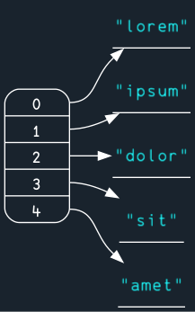
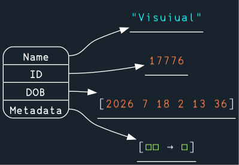
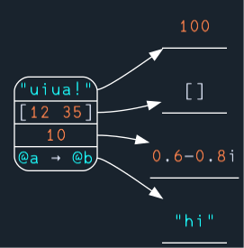
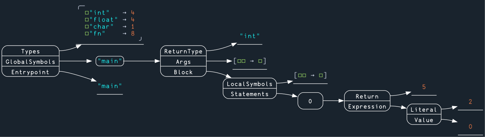
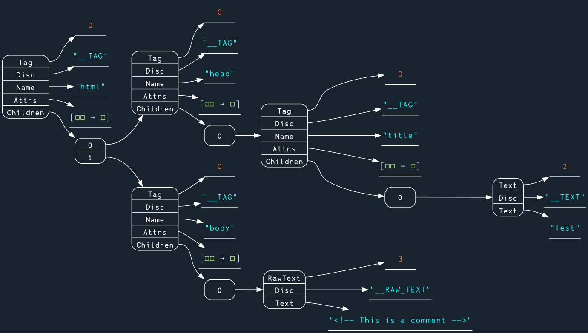
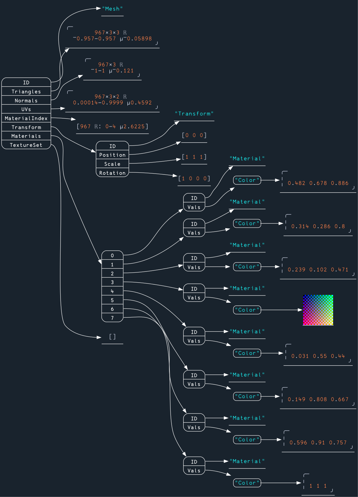

# Visuiual
A library for better printing of nested data structures.

## How to use?
You will need [Graphviz](https://graphviz.org) installed and accessible with the `dot` command.
Include the following import at the top of your file:
```
~ "gh: Dguto9/visuiual" ~ GV
```
Insert `GV` (graph view) wherever you want to view a structure; it will be printed as an image to your terminal. Uiua386 will be used as the font if installed.

`GG` (graph get) will generate the same image, and return it for manipulation or saving. 
> [!NOTE]
> Running Uiua with -w (window mode) can make it far easier to pan and zoom on the images.

> [!WARNING]
> Some results will not look good without a shorter summary bound for pretty printing. You may have to edit it yourself, or wait until we have more control over these parameters.

## Features
- Extraction of data definition field labels
- Display maps with any key type
- Pad-style coloring for leaf nodes
- Render arrays as images when appropriate
- Automatic cleanup of temporary files after run

## Output
All box arrays are shown as tables of labels pointing to their contents. Anything else is shown as it would be printed to the Uiua pad.
### Normal box array
Box arrays are labeled with their indices.



### Data definition
Data defs are labeled with their field names. More generally, any box array with all fields labeled is displayed in this way.



### Map
Maps are displayed with their keys (of any types) as the labels.



## Gallery


